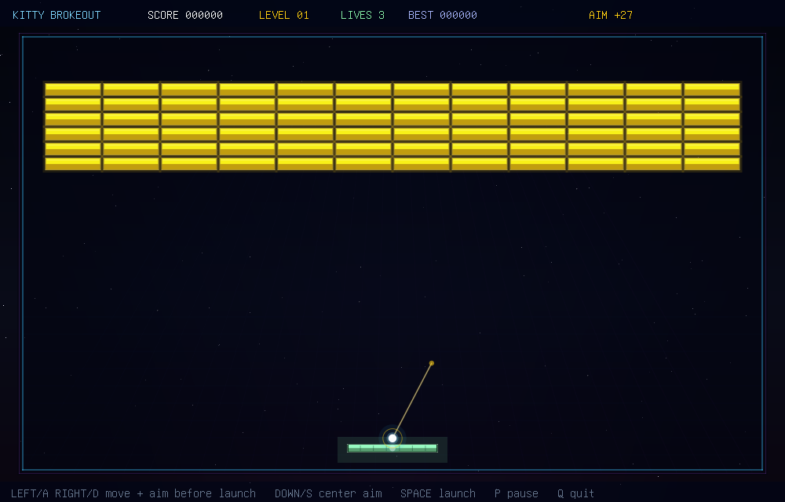

# Kitty Brokeout

A native C Breakout/Arkanoid-style game rendered as real pixels through the
kitty graphics protocol. No SDL, no X11, no ncurses: the game renders a
software RGBA framebuffer, compresses it with zlib, and streams it to the
terminal as kitty image frames.



The game has a responsive playfield, multi-hit bricks, metal bricks, explosive
bricks, speed bricks, falling capsules, particles, ball trails, screen shake,
level progression, procedural sound, and headless test modes.

## Features

- Kitty-protocol pixel graphics with double-buffered terminal frames
- Fixed-timestep gameplay with substepped ball collisions
- Multi-hit, metal, explosive, and speed bricks
- Wide paddle, slow, multiball, and shield capsules
- Aimed launch with a visible guide line
- Persistent local best score
- Particles, ball trails, screen flash, and screen shake
- Procedural sound through `pacat`, `pw-play`, `aplay`, or sox `play`
- Deterministic selftests and render tests for CI

## Build

Linux only. Needs gcc or clang, zlib, libm, pthreads, and a terminal that
supports the kitty graphics protocol:

```sh
make
./kitty-brokeout
```

Sound uses the first available sink among `pacat`, `pw-play`, `aplay`, or
sox `play`. If none exists, the game runs silently.

## Controls

| Key | Action |
|-----|--------|
| Left / A | move paddle left; aim left before launch |
| Right / D | move paddle right; aim right before launch |
| Down / S | center launch aim |
| Space / Enter / Up / W | launch ball, advance screens |
| P | pause |
| M | toggle sound |
| R | restart run |
| C | controls screen |
| Esc | title / resume |
| Q | quit |

## Development

```sh
make test
./kitty-brokeout --selftest 42 7200
./kitty-brokeout --render-test 7
./kitty-brokeout --sound-test
```

`--render-test` writes PPM screenshots for title, ready/aim, gameplay, level
clear, and game-over states without needing an interactive terminal.

## Architecture

| File | Role |
|------|------|
| `src/term.c` | raw mode, key decoding, kitty graphics frames |
| `src/game.c` | breakout rules, physics, levels, particles, powerups |
| `src/render.c` | software rasterizer, scene, HUD, menus |
| `src/sound.c` | procedural SFX synth and mixer |
| `src/main.c` | interactive loop, selftest, render-test, sound-test |

## License

MIT. See [LICENSE](LICENSE).
